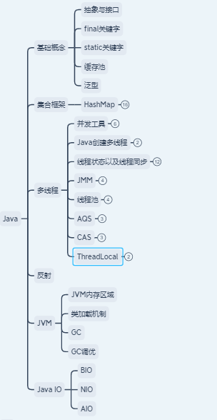
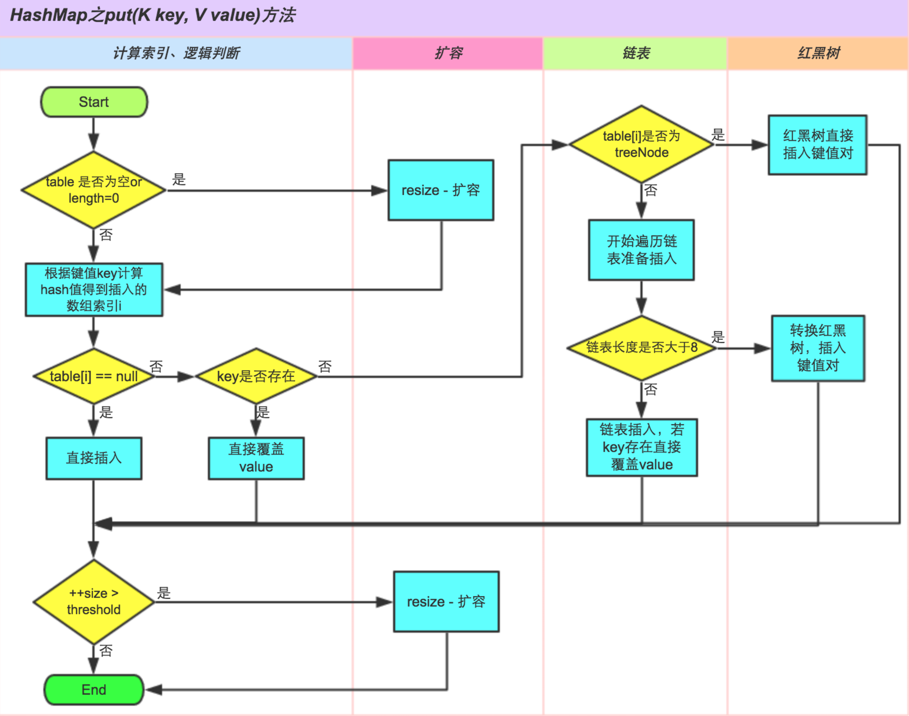
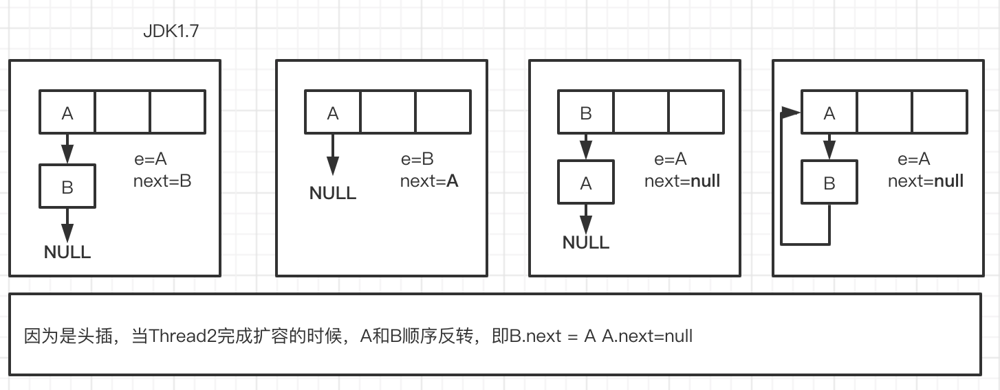

# Java常见核心命题


## 本章思维导图




## 基础概念

1. **抽象与接口**

   * 抽象是对类的抽象，为了解决代码复用，表示is-a的关系。是一种自下而上的设计思路，先有子类的代码重复，才有抽象上层父类；
   * 接口是对行为的抽象，侧重于解耦，实现了约定和实现的分离，表示has-a的关系。是一种自上而下的设计思路，先设计好接口，再考虑具体实现。

2. **```final```关键字**

   * final修饰变量：不可被修改
   * final修饰参数：在函数里不可被修改
   * final修饰方法：不可被重写（private级别的方法默认都是final）
   * final修饰类：不可被继承
   * **final修饰对象类型变量**，仅引用不可变

3. **```static```关键字**

   * 静态变量：类变量（属于类而非属于实例），所有实例共享，在内存中只有一份，会在类初始化的时候赋系统默认值（final修饰的除外）。**基本类型**会将值存储在方法区，而**引用类型**在方法区存储的是引用/堆地址
   * 静态方法：必须有实现，不可为抽象方法。
   * 静态代码块：仅类初始化运行一次，先父后子。
   * 静态内部类：
     * 在外部类的非静态方法中，使用方式没有差别
     * 在外部类的静态方法以及在其他类中，如果要使用，非静态内部类需要new Outter().new Inner();来实现，而静态内部类只需new Inner()即可。故，内部类都写成静态的
   * 静态导包：静态方法或者变量的使用方式是Class.method/var，采用静态导包之后，可以直接使用method而不必指明Class

4. **泛型**

   * 概念：参数化类型（区别于参数化变量）；仅在编译阶段有效，编译时的类型安全检测机制；运行期泛型消失（类型擦除）
   * 分类：泛型类 & 泛型接口 & 泛型方法
   * 类型通配符：
     * ```<?>```无界通配符
     * ```? extends Type``` 上边界通配符，只读不写，如list只能get而不能add()
     * ```? super Type``` 下边界通配符，只写不读，如list只能返回Object，作为函数返回类型没有意义
     * 通配符限定的范围是在确定"**参数化类型**"的时候

5. **缓存池**

   * 基本类型缓存池，如果对应包装类型的数值范围在缓存池内，直接使用缓存池中的对象

     * Code Demo: 
     ```java
       Integer a = 123; // Integer.valueOf(123)
       Integer b = 123;
       System.out.println(a == b); // true
       Integer a = new Integer(123);
       Integer b = new Integer(123);
       System.out.println(a == b); // false
       Integer a = 129;
       Integer b = 129;
       System.out.println(a == b); // false
     ```
     
     * Integer/short的范围为-128～127
     
   * String类型缓存池，保存所以String字面量，同时还可以inter()进行添加

     * inter(): 添加进String pool中返回该字符串的引用

## HashMap

较为详细的核心原理请参考[徒手撸轮子系列之HashMap——我们撸一个HashMap怎么样](https://yzhao.top/posts/myHashMap.html)

* 数据结构：数组（桶）+链表（拉链法）

* hash计算公式以及优势：
  * 借助Object类的hashCode()
  * ```h=h^(h>>>16)``` 这里的改进就是高16位与低16位异或，主要优化低16位相等时的哈希值，减少哈希冲突
  * **寻址算法**：```n=(n-1)&h```本质是对n求模，即```h%n=h&(n-1)```，尤其是当n为2的n次幂时寻址更加均匀，所以默认的HashMap的长度为```1<<<4```
  
* 加载因子为什么设置为0.75？过大哈希冲突的概率增加；过小则浪费空间，频繁扩容

* ```V put(K key, V value)``` 新增KV对流程：
  * hash算法：得到桶下标，即```i = (n-1)&h```
  * 若桶数组为空，扩容
  * 若当前桶下标为空，newNode，即```tab[i]=new Node<>(hash, key, value, next)```
  * 若当前桶下标有值，即**哈希冲突**，采用拉链法解决
    * 创建临时节点e
    * 若```p.hash == q.hash && p.key == q.key && p.key.equals(q.key) => e = p```
    * 若是红黑树，则使用红黑树的方式新增
    * 若是链表
      * 遍历结束，证明是新增节点，所在尾端新增node
      * 如果在循环过程中发现有相同的key的时候，证明是覆盖节点，此时该节点为e，结束循环；
    * 最后，对相同的key，如果运行覆盖value，则此时进行value值覆盖，并返回oldvalue
  * 若当前HashMap的```size>threshold```（首次扩容=0.75*16=12）时，扩容
  具体新增流程为：
  
* ```Node<K, V>[] resize()``` 扩容
  * 记录现有的capacity以及现有的Threshold
  * 不可超过最大MAXMUM_CAPACITY且扩容为现在的2倍
  * 若链表长度为1，直接赋值
  * 若该节点是红黑树，则进行相关操作
  * 若链表不为1，进行**链表复制**，JDK1.8优化：
    * 若e.hash & oldCap == 0，还是用原索引，放在原来的桶里
    * 若e.hash & oldCap == 1，放在新的桶里，新的索引=原索引+oldCap
  * **优化点**：在进行链表复制的时候，通过e.hash & oldCap 的结果来判断新的索引地址  
* ```V get(Object key)``` 查找
  * 计算key的hash值，以及桶下标
  * 若链表的第一个节点的key就是目标key，则返回该节点(e.val)
  * 否则，进行循环遍历判断key是否是目标key
  * 若某一个节点位红黑树节点，则使用红黑树的方式遍历
* **并发场景梳理**
  * HashMap是非线程安全的，不保证线程获取数据的一致性
  * 链表成环问题（JDK1.8已经修复）:
    * 扩容流程：```next=e.next -> tab[i]=e -> e = next```
    * **风险点**：这里采用的是头插法插入节点，会改变链表原来节点的顺序


注意：HashMap依旧是线程不安全的，所产生的线程问题无非就是同一份数据被不同的线程所改变造成的（**即原子性被打断**）。


## 并发
### ConcurrentHashMap
**核心**：CAS + synchronized
Node<K,V> table采用了**volatile**来修饰
hash函数的小改进：(h^(h>>>16))&HASH_BITS HASH_BITS主要是为了消除符号位置，即MAX_VALUE;因为在ConcurrentHashMap中的hash需要表示正在转移(-1)、转移成树(-2)以及保留值(-3)
```V put(K key, V value) ```
- 数组为空，初始化；
- 若当前槽点没有值，CAS创建节点，失败自旋（for循环）
- 若槽点有值，判断当前槽点是不是MOVED节点，如果是，会参与扩容
- 若槽点有值且扩容完成，锁定当前槽，链表尾插
- 线程安全的手段：
  - 数组初始化通过自旋+CAS+double check保证初始化成功 initTable()
  - 新增节点时：
    - 自旋确保一定可以成功；
    - 槽点为空时，通过CAS新增，如果失败，则自旋；
    - 槽点有值，锁槽点
    - 红黑树旋转时，锁root

```void transfer(Node<K,V>[] tab, Node<K,V>[] nextTab) ```

- 拷贝数组时从尾部开始；
- 拷贝槽点，锁原数组槽点，拷贝完成时，原数组槽点赋值为ForwardingNode
- 此时如果有put到此槽点时，发现时MOVED会参与增加线程帮助扩容

### synchronized

- 原理：无锁 --> 偏向锁 --> 轻量级锁 --> 重量级锁
- 使用方式：

  - **类锁**：类共有的，不同的实例也会被锁住；除此之外，还有String的字面量赋值以及基本数据类型的包装类型在缓存池范围内的情况下
  - **对象锁**：实例共有，同一个实例才会被锁住

### 线程状态

- 新建状态new，线程创建但未启动
- 就绪状态runnable，调用start()
- 运行状态running，获得CPU执行时间片
- 阻塞状态blocked，同步阻塞；主动阻塞；被动阻塞
- 终止状态dead

### Java创建线程方法

- ```class A extends Thread{}``` 继承Thread类，并重写run()方法；
- ```class B implements Runnable```实现Runnable接口，作为Thread参数
- ```class C implements Callable<T>```实现Callable接口，作为Future的参数，Future再作为Thread的参数，可接受返回值

代码示例：

```java
//1 class A extends Thread
new A().start();
//2 runnable
new Thread(()->{....}).start(); // 用lambda表达式来实现runnable
//3 callable
Future<Integer> future = new Future<>(()->{....}); // 用lambda来实现callable
new Thread(future).start();
System.out.println(future.get()); // 获得返回值
```

无论哪种方式，本质都是```new Thread()``` 无非使用了不同的start方法

### 线程同步

* 当该线程执行完某一项功能之后，可以调用this.notify() or this.notifyAll()方法来唤醒所有阻塞的线程，再使用this.wait()是自己进入阻塞状态
  * 注意：一定要先唤醒，否则一旦自己陷入阻塞状态的时候，是不会释放锁的

交替打印奇偶：

```java
public class ThreadTest {
    
    public void printOdd() {
        synchronized (this) {
            for (int i = 0; i < 10; i++) {
                if (i%2 != 0) System.out.println(Thread.currentThread().getName() + ": " + i);
                this.notifyAll();
                try {
                    this.wait();
                } catch (InterruptedException e) {
                    e.printStackTrace();
                }
            }
        }
    }

    public void printEven() {
        synchronized (this) {
            for (int i = 0; i < 10; i++) {
                if (i%2 == 0) System.out.println(Thread.currentThread().getName() + ": " + i);
                this.notifyAll();
                try {
                    this.wait();
                } catch (InterruptedException e) {
                    e.printStackTrace();
                }
            }
        }
    }

    public static void main(String[] args) {
        ThreadTest threadTest = new ThreadTest();
        new Thread(threadTest::printOdd, "thread-1").start();
        new Thread(threadTest::printEven, "thread-2").start();
    }
}
```

除了原始的notify与wait方法，J.U.C还提供其他好用的同步工具

* CountDownLatch，当计数器为0时，在CountDownLatch上await的线程会被唤醒；适用于等待所有子线程全部完成之后再做操作的场景，可以类比join
* CycliBarrier，等待所有线程到达统一状态，再进行全部同时执行
  * 使用await进行阻塞，等待所有线程都执行到await之后，再同时执行后续操作；而且支持可重复使用
  * ```new CycliBarrier(nums)``` 表示能控制几个线程，大于这个数目的线程不受CycliBarrier控制
* Semaphore，前两个是内部维护一个状态码，判断是否为0，而信号量是增加的机制
  * ```semaphore.release()``` 使得信号量+1；
  * ```semaphore.acquire(nums)```阻塞，等待信号量累加到nums的值，才进行执行代码
* Condition,需要Lock来通过newCondition()进行调用
  * ```condition.signalAl()```
  * ```condition.await()```

### 线程池


### JMM(Java内存模型)


### AQS

AQS: AbstracQueuedSynchronizer抽象同步队列

**基本场景**：加锁；释放锁；等待；唤醒

**state状态维护**：

* volatie修饰，保证内存可见性
* getState以及setState禁止子类重写
* compareAndSetState()采用乐观锁CAS

**CLH队列**（FIFO的双向队列）

* 当前线程获取state失败，AQS会构建节点加入CLH同步队列中，阻塞该线程；
* 当同步状态释放时，会把首节点唤醒（公平锁），使其尝试获取同步状态

**Condition通知机制，维护了等待队列**

* 调用了await()方法的线程，加入到Condition等待队列，同时唤醒CLH队列的下一个节点；
* 线程中调用了signal()方法后，Condition等待队列的首位等待任务会被加入CLH队列中，等待被唤醒
* 当线程调用unLock()方法后，CLH队列下一个节点会被唤醒

独占和共享模式

自定义同步器。摘抄自《Java并发编程之美》

```java
public class NonReentrantLock implements Lock,Serializable {
  
  static class Sync extends AbstractQueueSynchronizer {
    //1 锁是否被持有 1被持有
    public boolean isHeldExclusively(){
      return getState() == 1;
    }
    //2 尝试获取锁
    public boolean tryAcquire(int arg){
      assert arg == 1;
      if(compareAndSetState(0,1)){
        setExclusiveOwnerThread(Thread.currentThread());
        return ture;
      }
      return false;
    }
    // 3 释放锁
    public boolean tryRelease(int arg){
      assert arg==1;
      if(getState==0){
        throw new IllegalMonitorStateException();
      }
      setExclusiveOwnerThread(null);
      setState(0);
      return true;
    }
    
    // 4 返回Condition
    Condition newCondition(){
      return new ConditionObject();
    }
  }
  
  private final Sync sync = new Sync();
  
  @Override
  public void lock(){
    sync.acquire(1);
  }
  
  public boolean isLocked(){
    return sync.isHeldExclusively();
  }
  
  public void lockInterruptibly()throws InterruptedException {
    sync.acquireInterruptibly(1);
  }
  
  @Override
  public boolean tryLock(){
    return sync.tryAcquire(1);
  }
  
  @Override
  public boolean tryLock(long time, TimeUnit unit) throws InterruptedException {
    return sync.tryAcquireNanos(1, unit.toNanos(time));
  }

  @Override
  public void unLock(){
    sync.release(1);
  }
  
  @Override
  public Condition newCondition(){
    return sync.newCondition();
  }

}
```

**ReentrantLock**

- lock.lock()
- lock.unlock()
- lock.newConditoin()


### CAS

Unsafe：

* compareAndSwapObject
* compareAndSwapInt
* compareAndSwapLong
* ...

AtomicXXX

CAS是Java Unsafe类中实现的操作，是native方法，其是一种**无锁的编程手段**，全称是 Compare And Set。CAS(V,A,B) 将V上的值与A做比较，如果相等，则更新为B;否则，禁止更新，返回V的值

CAS的核心问题

- ABA问题：所谓ABA问题，指的是一个值由A变成了B，又变成了A，我此时使用CAS去赋值的时候，认为没有变化，则会进行赋值，但是实际上已经变化了。解决方案就是增加版本号
- ABA主要的例子：如果一个链表的A.next被修改过，虽然A还是A，但是其实最终的结果和我们想要的不一样
- 循环时间长，开销大
- 只能保证一个共享变量的原子操作


### ThreadLocal

**原理**：静态内部类维护了ThreadLocalMap，维护了实例(V)与ThreadLocal(K)的映射；其中，key是弱引用，但是value是强引用，依旧会出现内存泄露的问题

场景：

* ThreadLocal不能解决线程间数据共享的问题（因为其只是线程本地变量）
* ThreadLocal隐式的在不同线程创建独立实例副本避免线程安全
* ThreadLocalMap维护了ThreadLocal(与线程挂钩)与Object的映射
* ThreadLocal适用于变量在线程间隔离且在方法间共享的场景


### J.U.C相关工具

CompletableFuture，是属于ForkJoin的实现

* 异步提交任务的方法supplyAsync()或者是runAsync() 前者接受返回值，后者没有返回值
* 有其他来进行多个任务串联进行的方式，如thenApply()等